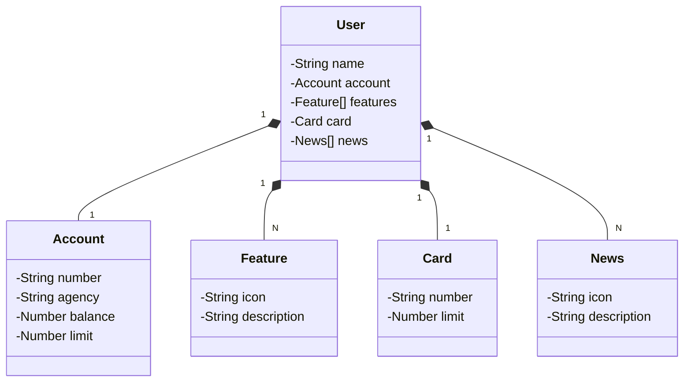

# Santander Dev Week 2023
Java RESTful API created for Santander Dev Week 2023.

## Requirements
- Java 17/19
- Gradle 8.8
- Spring Boot 3
- Spring Data JPA (database integration)
- Swagger (API documentation)
- Railway (API deployment)

## Class diagram
The class diagram below is in Mermaid syntax.


## Installation
1. Clone this repository.
```bash
git clone https://github.com/JoaoBarroso4/sdw-2023-api.git
```
2. Open the project in your favorite IDE.
3. Configure the `application.properties` file with your database settings.
4. Set up the profiles. The available profiles are `dev` and `prd`.
5. Create a .env file with the following variables:
```bash
PGHOST=your_host
PGPORT=your_port
PGDATABASE=your_database
PGUSER=your_user
PGPASSWORD=your_password
```
6. Run docker-compose.
```bash
docker-compose up -d
```
7. Run the application.

The API will be available at `http://localhost:8080`. Access the documentation at `http://localhost:8080/swagger-ui.html`.


## API Endpoints
- `GET /users`: Get a list of all registered users.
- `GET /users/{id}`: Get the data of a user based on its ID.
- `POST /users`: Create a new user.
- `PUT /users/{id}`: Update the data of an existing user based on its ID.
- `DELETE /users/{id}`: Remove an existing user based on its ID.
